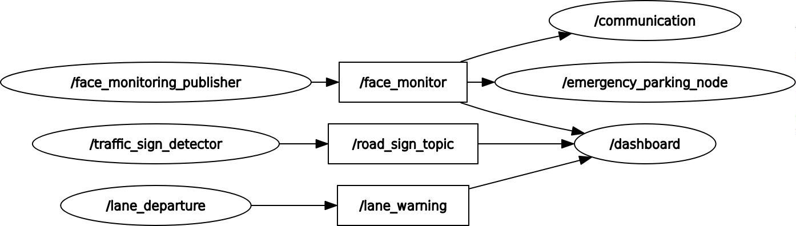

# ADMAS ROS 2 System – Communication and Architecture

This is the ROS 2 workspace for the **Advanced Driver Monitoring and Assistance System (ADMAS)**.  
It consists of multiple interconnected nodes handling monitoring, detection, communication, alerting, and automated response.

---
##  System Architecture Diagram



##  Communication Flow Between Nodes

**Driver Monitoring**

**Topic:** `/face_monitor`

**Used by:**

- `communication_node.py` – Sends emergency alert.
- `emergency_parking_node.py` – Initiates safe parking.
- `dashboard_node.py` – Displays driver status and alert.

**GPS**

**Handled internally in:** `communication_node.py`

- Adds real-time location data.
- Sends it to the web app as part of the emergency payload.

**Lane Detection**

**Topic:** ( `/lane_warning`)

**Subscribed by:**

- `dashboard_node.py` – Displays lane status and triggers audio alerts.

**Traffic Sign Detection**

**Topic:** ( `/road_sign_topic`)

**Subscribed by:**

- `dashboard_node.py` – Displays detected signs on the screen.

---

##  Included ROS 2 Packages

| Package                  | Function                                                         |
|--------------------------|------------------------------------------------------------------|
| `face_monitor`           | Driver fatigue & face status monitoring                          |
| `dashboard`              | visual GUI dashboard and YOLO-based real-time road sign detection|
| `lane_departure_warning` | Detects and alerts on lane departure                             |
| `emergency_parking`      | Handles motor control for auto parking                           |
| `communication`          | GPS + all remote communications                                  |

---

##  Building the Workspace

```bash
cd ros_modules
colcon build
source install/setup.bash
````

> Make sure each package has:
>
> * `package.xml`
> * `setup.py` with `entry_points`
> * A proper `main()` function
> * `__init__.py` in source folders

---

##  Topics Summary

| Topic              | Publisher                | Subscribers                                       |
| -------------------| ------------------------ | ------------------------------------------------- |
| `/face_monitor`    | `face_monitor.py`        | `communication`, `emergency_parking`, `dashboard` |
| `/lane_warning`    | `lane_departure_node.py` | `dashboard`                                       |
| `/road_sign_topic` | `traffic_signs_node.py`  | `dashboard`                                       |

---

##  Structure

```
ros_modules/
├── communication/
├── face_monitor/
├── dashboard/
├── emergency_parking/
├── lane_departure_warning/

```

---

##  Contributors

* CANITEY 
* 0xAhmadAlaa 


---

##  License

MIT License
© 2025 ADMAS SCU Graduation Team

